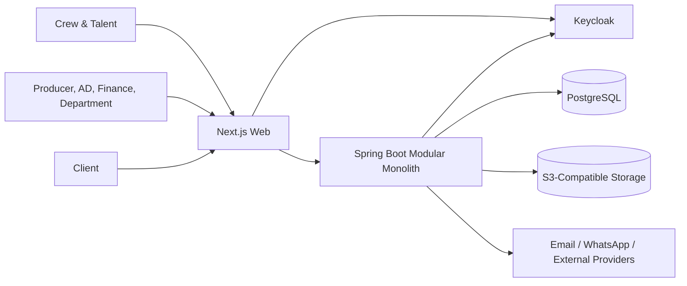

# Architecture Blueprint

Status: Approved  
Owner: Roni / Engineering  
Last Reviewed: 2026-07-22  
Applies To: Whole System  
Related Documents:
- ../00-governance/PROJECT_CONSTITUTION.md
- adr/ADR-0001-use-modular-monolith.md

## 1. Architectural Style

Backend dibangun sebagai modular monolith dengan Spring Boot dan Spring Modulith.

## 2. System Context

## 3. Backend Modules

- identityaccess
- organization
- project
- crewtalent
- scriptscene
- scheduling
- callsheet
- onset
- reporting
- equipment
- finance
- documents
- postproduction
- notification
- audit

## 4. Deployment Awal

- 1 Next.js application
- 1 Spring Boot application
- 1 PostgreSQL instance
- 1 Keycloak instance
- 1 object storage
- optional reverse proxy
- background outbox processor berada pada aplikasi backend yang sama

## 5. Transaction Boundary

Transaction SHOULD dimulai pada application service. Satu transaction MUST hanya memodifikasi aggregate yang memang diperlukan. External provider MUST NOT dipanggil di dalam transaction.

## 6. Async Boundary

Efek eksternal ditulis ke outbox dalam transaction yang sama. Worker mengirim event setelah commit.

## 7. Identity dan Authorization

Keycloak menjawab siapa user. Aplikasi menjawab apa yang boleh dilakukan user berdasarkan organization, project, role, department, resource state, dan explicit sharing.

## 8. File

File binary berada di object storage. PostgreSQL menyimpan metadata, ownership, checksum, dan audit reference.

## 9. Observability

- JSON structured logs
- correlation ID
- request ID
- metrics
- distributed trace
- health endpoints
- slow operation metrics
- outbox backlog metrics

## 10. Explicit Non-Goals Awal

- microservices
- Kafka
- Kubernetes
- event sourcing penuh
- CQRS menyeluruh
- native application
- multi-region active-active

## 11. Evolusi

Modul MAY dipisahkan jika ada data terukur tentang beban, deployment independence, ownership tim, atau kebutuhan availability yang berbeda.
