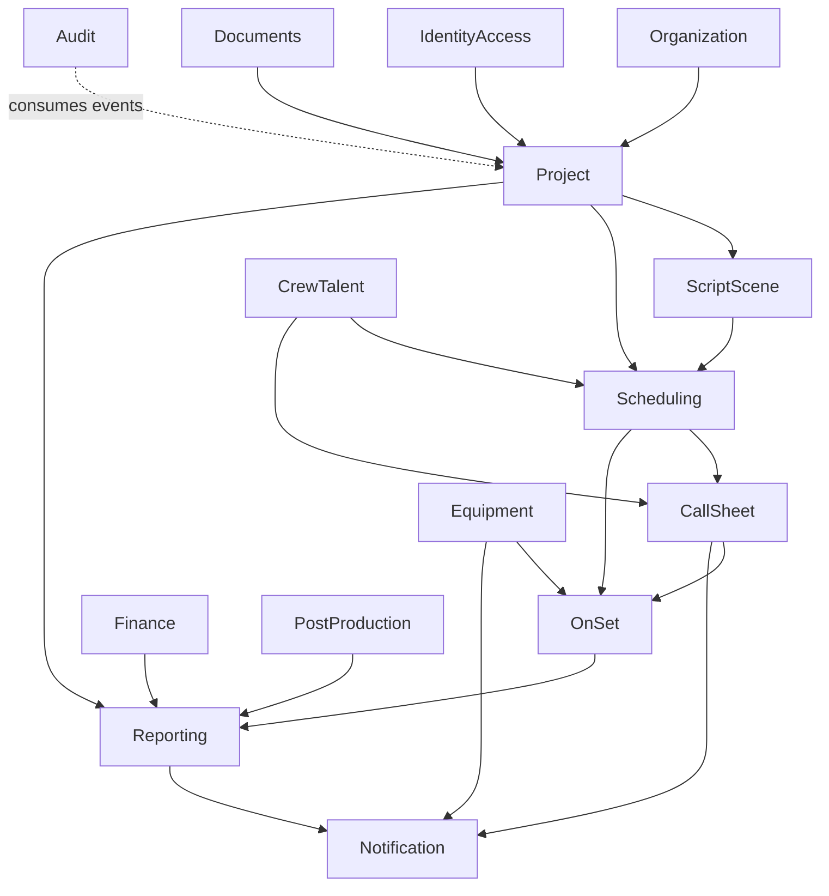

# Module Dependency Map

Status: Draft  
Owner: Roni / Product & Engineering  
Last Reviewed: 2026-07-22  
Applies To: Backend Modules  
Related Documents:
- Belum ditentukan

## Rules

- Panah berarti dependency yang diizinkan melalui public API atau event.
- Repository dependency lintas modul dilarang.
- Event consumer tidak boleh mengubah ownership data producer secara langsung.
- Dependency baru membutuhkan update dokumen dan architecture test.
